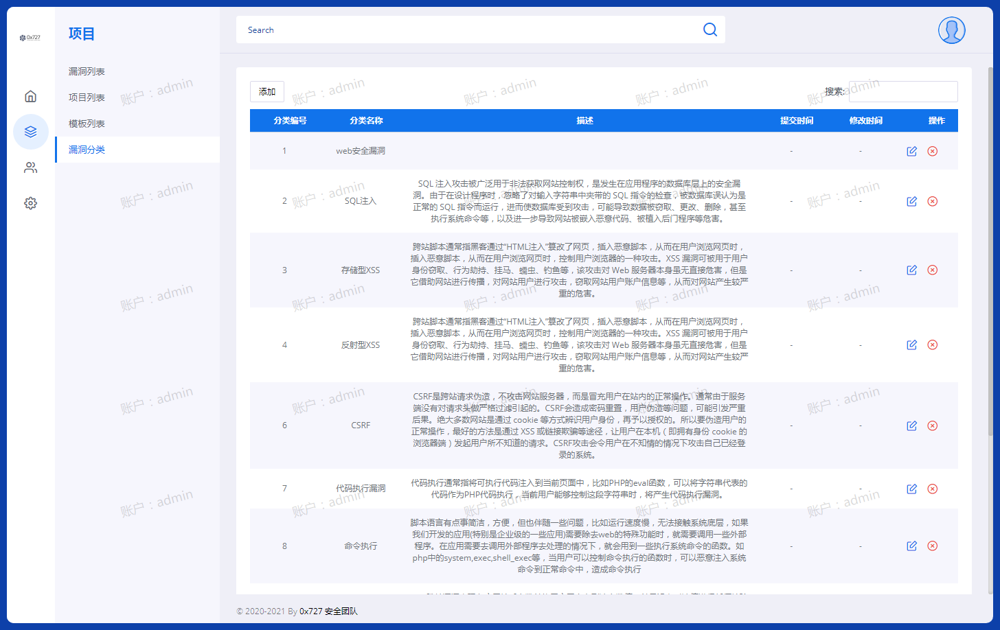
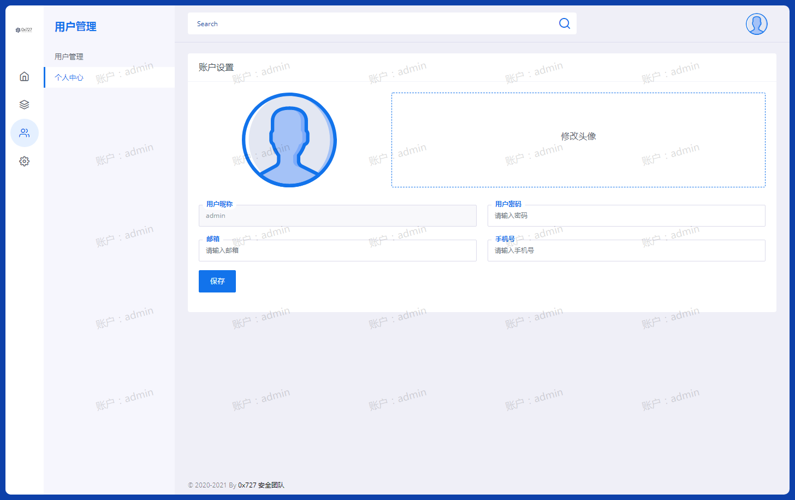
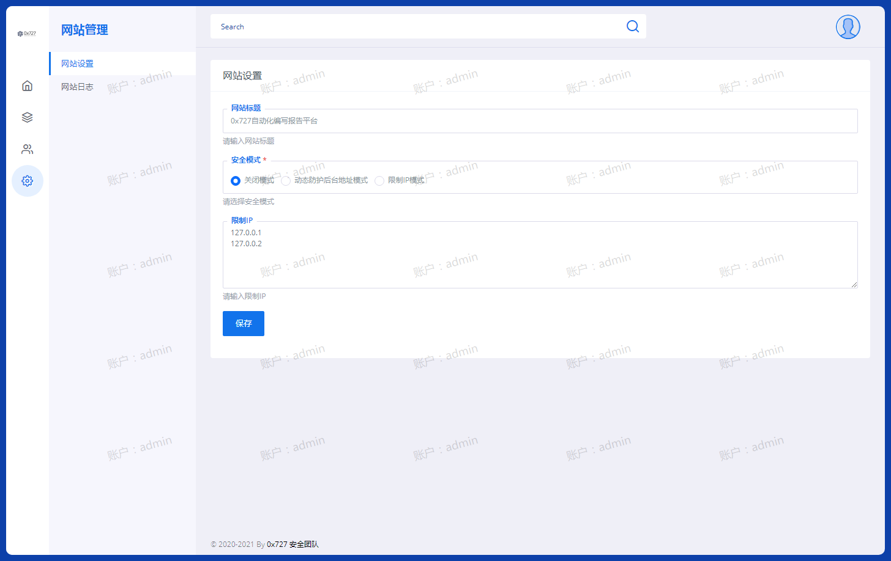

# 0x727自动化编写报告平台

[](https://github.com/0x727/BugRepoter_0x727/releases)

郑重声明：文中所涉及的技术、思路和工具仅供以安全为目的的学习交流使用，任何人不得将其用于非法用途以及盈利等目的，否则后果自行承担。

## 0x01 介绍

| 类别 | 说明 |
| ---- | --- |
| 作者 | [小洲](https://github.com/xz-zone) |
| 团队 | [0x727](https://github.com/0x727) 未来一段时间将陆续开源工具 |
| 定位 | 根据安全团队定制化协同管理项目安全，可快速查找历史漏洞，批量导出报告。 |
| 语言 | Python，PHP，Html，Javascript，css |
| 系统 | Centos/Ubuntu |
| 需要环境 | nginx+php+mysql+python3 |

## 0x02 效果展示
### 1 安装所需文件夹权限

|  文件夹   | 权限要求  |说明  |
|  ----  | ----  |----  |
| classes  | 读写（766） | class类|
| config  | 读写（766） | 配置文件|
| index  | 读写（766） | 主模块|
| lib  | 读写（766） | 插件|
| public  | 读写（766） | 公共文件|
| python_web  | 读写（766） | word表格制作|
| runtime  | 读写（777） | 缓存|

 注意：以上7个目录和目录下文件，除runtime必须具有可写权限777，其他必须具有可写权限766，非ROOT或管理员组权限！

### 2 进入安装界面
现在我们要做的就是安装0x727自动化编写报告平台，在网页地址栏输入框中，输入 http://域名/index.php 后，按回车键，即可进入安装界面，如同：
注册协议


网站配置


程序安装


安装完成


## 0x03 功能介绍

### 1 首页

描述：首页统计团队某成员提交漏洞数量，并可以查看到整个项目漏洞类型分类


### 2 项目

#### 2.1 漏洞列表

描述：漏洞列表可以直观看到某成员提交漏洞报告，并且可以支持批量导出报告。


#### 2.2 项目分类

描述：项目分类可以根据自身的挖掘漏洞需求进行创建项目分类。


#### 2.2.1 项目资产

描述：可以查看当前项目域名有哪些。


#### 2.2.2 漏洞分布图

描述：可以查看到漏洞分布图。


#### 2.3 模板列表

描述：模板列表可以自定义上传模板，导出报告的时候使用某类型模板。


#### 2.4 漏洞分类

描述：漏洞分类可以创建某类型分类，比如：web安全漏洞-》xxe注入。



### 3 用户管理

#### 3.1 用户管理

描述：用户管理可以创建团队成员账户，并且可以协同提交漏洞。


#### 3.2 个人中心

描述：个人中心可以修改个人信息，方便管理员识别并且联系。



### 4 网站设置

#### 4.1 网站设置

描述：网站设置可以某ip访问当前报告模板，提高后台访问的权限。



#### 4.2 网站日志

描述：网站日志可以审计到某成员访问某个控制器，如遇到攻击会进行记录日志。


## 0x04 Python安装与环境运行

```
yum -y groupinstall "Development tools"
yum -y install zlib-devel bzip2-devel openssl-devel ncurses-devel sqlite-devel readline-devel tk-devel gdbm-devel db4-devel libpcap-devel xz-devel
yum -y install libffi-devel
wget https://www.python.org/ftp/python/3.7.0/Python-3.7.0.tar.xz
tar -xvJf  Python-3.7.0.tar.xz
mkdir /usr/local/python3
cd Python-3.7.0
./configure --prefix=/usr/local/python3
make && make install
ln -s /usr/local/python3/bin/python3 /usr/local/bin/python3
ln -s /usr/local/python3/bin/pip3 /usr/local/bin/pip3
python3 -m pip install docxtpl==0.12.0
```

进入项目目录并且执行

```
nohup ./python_web/run.sh 2>&1 &
```

## 0x05 nginx安全配置

在当前nginx项目中配置以下：

```
# 禁止访问目录列
autoindex off;

# 禁止访问核心目录
location ^~ /index/ {
  deny all;
}
# 禁止访问类模块
location ^~ /classes {
  deny all;
}
# 禁止访问config配置模块
location ^~ /config {
  deny all;
}
# 禁止访问扩展模块
location ^~ /lib {
  deny all;
}
# 禁止访问生成报告模块
location ^~ /python_web {
  deny all;
}
# 禁止访问缓存模块
location ^~ /runtime {
  deny all;
}
# 禁止访问auto目录图片
location ^~ /public/auto/ {
  deny all;
}
# 禁止访问img目录图片
location ^~ /public/img/ {
  deny all;
}
# 禁止访问docker目录
location ^~ /docker {
   deny all;
}
#一键申请SSL证书验证目录相关设置
location ~ \.well-known{
    allow all;
}
#禁止访问文件后缀文件
location ~ .*\.(sh|py|docx|doc|ini|yml) {
  deny all;
}
```


## 0x06 Docker一键安装

```
首先给予目录所有权限
chmod 777 -R BugRepoter_0x727

进去docker目录
cd docker

运行run_docker.sh
```


## 0x07 版本更新

V1.0 项目支持项目批量提交，批量按项目分类进行导出，快速生成并且统计年度汇总报告。

V1.1 防截图功能，避免项目成员私自截图分享到互联网。报告上传的图片采用RC4加密算法进行加密图片，更好的防止图片泄露。

V1.2 URL防止篡改，更好提高网站安全性。防止恶意获取URL请求。

V1.3 增加项目资产自动归属，增加漏洞分布图。

V1.4 优化一键安装页面问题。

V1.5 增加docker一键部署环境。

V1.6 增加复测报告导出，优化一键安装页面问题。

V1.7 解决docker环境部署兼容性问题。

V1.8 优化登陆防护，判断用户输入错误多次并且锁定账户。

```
增加domain_member字段
ALTER TABLE `domain_member`
ADD COLUMN `error_num`  int(11) NULL DEFAULT 0 AFTER `img`,
ADD COLUMN `error_time`  int(11) NULL DEFAULT 0 AFTER `error_num`;
```

V1.9 优化一键安装页面，解决docker中的php运行报错问题。

## 0x08 待添加/优化功能

V1.10 增加github对比并自动更新。

V1.11 增加邮件提醒功能，漏洞报告提交超过5天后自动提醒提交者是否修复漏洞。

V1.12 增加自定义模板上传，需要申请wps开发者平台权限。

V1.13 增加报告分享外链方式进行分享，无需登录即可查看报告内容。

V1.14 增加防漏扫功能，避免Awvs，Nessus等一些开源软件进行漏洞扫描。

V1.15 增加认证访问链，自动形成整条认证访问链，行为操作链。

V1.16 优化post提交内容，进行RSA加密进行提交到后端。

V1.17 优化页面弹出消息提示层。

V1.18 增加附件管理，方便团队协作共享文档，文件等。

V1.19 增加数据库备份，方便数据迁移。

## 0x09 反馈

BugRepoter_0x727（自动化编写报告平台） 是一个免费且开源的项目，我们欢迎任何人为其开发和进步贡献力量。

* 在使用过程中出现任何问题，可以通过 issues 来反馈。
* Bug 的修复可以直接提交 Pull Request 到 dev 分支。
* 如果是增加新的功能特性，请先创建一个 issue 并做简单描述以及大致的实现方法，提议被采纳后，就可以创建一个实现新特性的 Pull Request。
* 欢迎对说明文档做出改善，帮助更多的人使用 自动化编写报告平台。
* 贡献代码请提交 PR 至 dev 分支，master 分支仅用于发布稳定可用版本。

*提醒：和项目相关的问题最好在 issues 中反馈，这样方便其他有类似问题的人可以快速查找解决方法，并且也避免了我们重复回答一些问题。*

## Stargazers over time

[](https://starchart.cc/0x727/BugRepoter_0x727)

